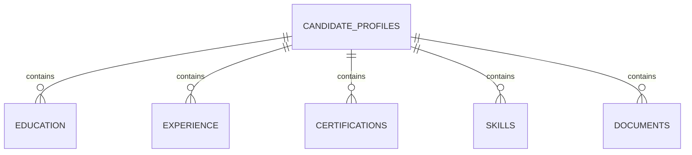

# Candidate Domain Data Model

## Overview

This document defines the Firestore model for the Candidate domain.

It is intentionally limited to structure, relationships, and indexing guidance.

## Primary Collection

### `candidateProfiles/{uid}`

The canonical candidate aggregate.

Suggested fields:

- `uid`
- `status`
- `visibility`
- `completionPercentage`
- `completionState`
- `headline`
- `location`
- `summary`
- `currentCVId`
- `primaryCVPath`
- `primaryCVUrl`
- `lastPublishedAt`
- `createdAt`
- `updatedAt`

## Subcollections

### `candidateProfiles/{uid}/education/{educationId}`

Education entries.

Suggested fields:

- `schoolName`
- `degree`
- `fieldOfStudy`
- `startDate`
- `endDate`
- `currentlyStudying`
- `description`
- `createdAt`
- `updatedAt`

### `candidateProfiles/{uid}/experience/{experienceId}`

Experience entries.

Suggested fields:

- `companyName`
- `title`
- `employmentType`
- `location`
- `startDate`
- `endDate`
- `currentlyWorking`
- `summary`
- `responsibilities`
- `createdAt`
- `updatedAt`

### `candidateProfiles/{uid}/certifications/{certificationId}`

Certification entries.

Suggested fields:

- `name`
- `issuer`
- `issueDate`
- `expirationDate`
- `credentialId`
- `credentialUrl`
- `createdAt`
- `updatedAt`

### `candidateProfiles/{uid}/skills/{skillId}`

Skill entries.

Suggested fields:

- `name`
- `level`
- `yearsOfExperience`
- `verified`
- `createdAt`
- `updatedAt`

### `candidateProfiles/{uid}/documents/{documentId}`

Document and CV metadata.

Suggested fields:

- `type`
- `title`
- `storagePath`
- `downloadUrl`
- `fileName`
- `mimeType`
- `fileSize`
- `version`
- `isCurrent`
- `createdAt`
- `updatedAt`

## Relationships

## Lifecycle Fields

- `status` tracks the profile stage.
- `visibility` controls exposure.
- `completionPercentage` is derived from required sections.
- `completionState` is a coarse status for routing and UX.

## Validation Rules

- Required IDs must match the owning `uid`.
- Enum fields must be restricted to defined values.
- Dates must be valid and consistently ordered.
- `isCurrent` should be unique per document type when used for the primary CV.
- The profile should not be publishable without required sections.

## Recommended Indexes

- `candidateProfiles`: `status` + `visibility` + `updatedAt desc`
- `candidateProfiles`: `completionPercentage` + `updatedAt desc`
- `candidateProfiles/{uid}/education`: `currentlyStudying` + `startDate desc`
- `candidateProfiles/{uid}/experience`: `currentlyWorking` + `startDate desc`
- `candidateProfiles/{uid}/documents`: `type` + `isCurrent desc` + `createdAt desc`

## Notes

- Storage handles file bytes; Firestore handles metadata.
- The model can later support search and ranking without changing the aggregate root.
