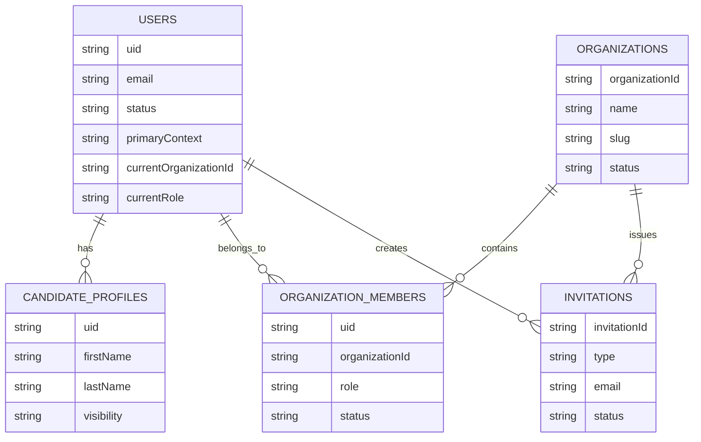

# Identity And Access Data Model

## Collections

### `users/{uid}`

Canonical user profile for every authenticated account.

Suggested fields:

- `uid`
- `email`
- `displayName`
- `photoURL`
- `phoneNumber`
- `emailVerified`
- `status` (`pending`, `active`, `suspended`, `deleted`)
- `lastLoginAt`
- `createdAt`
- `updatedAt`
- `primaryContext` (`platform`, `company`, `candidate`)
- `currentOrganizationId` nullable
- `currentRole` nullable

### `organizations/{organizationId}`

Company profile and tenant boundary.

Suggested fields:

- `organizationId`
- `name`
- `legalName`
- `slug`
- `status`
- `createdByUid`
- `createdAt`
- `updatedAt`

### `organizations/{organizationId}/members/{uid}`

Company membership and role assignment.

Suggested fields:

- `uid`
- `organizationId`
- `role` (`COMPANY_OWNER`, `COMPANY_USER`, `RECRUITER`)
- `status` (`invited`, `active`, `disabled`)
- `invitedByUid`
- `joinedAt`
- `createdAt`
- `updatedAt`

### `candidateProfiles/{uid}`

Candidate-specific profile data.

Suggested fields:

- `uid`
- `firstName`
- `lastName`
- `headline`
- `location`
- `resumeUrl`
- `skills`
- `experienceSummary`
- `visibility`
- `createdAt`
- `updatedAt`

### `invitations/{invitationId}`

Pending candidate or company invites.

Suggested fields:

- `type` (`candidate`, `company`)
- `email`
- `organizationId` nullable
- `role` nullable
- `status` (`pending`, `accepted`, `expired`, `revoked`)
- `tokenHash`
- `createdByUid`
- `expiresAt`

## Relationships

## Data Ownership

- Firebase Authentication owns credential state.
- `users/{uid}` owns canonical profile state.
- `organizations/{organizationId}` owns company tenant state.
- Membership documents own company role assignments.
- Candidate profiles own candidate-specific data.

## Notes

- Platform roles should be reflected in Custom Claims and mirrored in `users/{uid}` only as derived metadata.
- Firestore remains the source of truth for membership relationships.