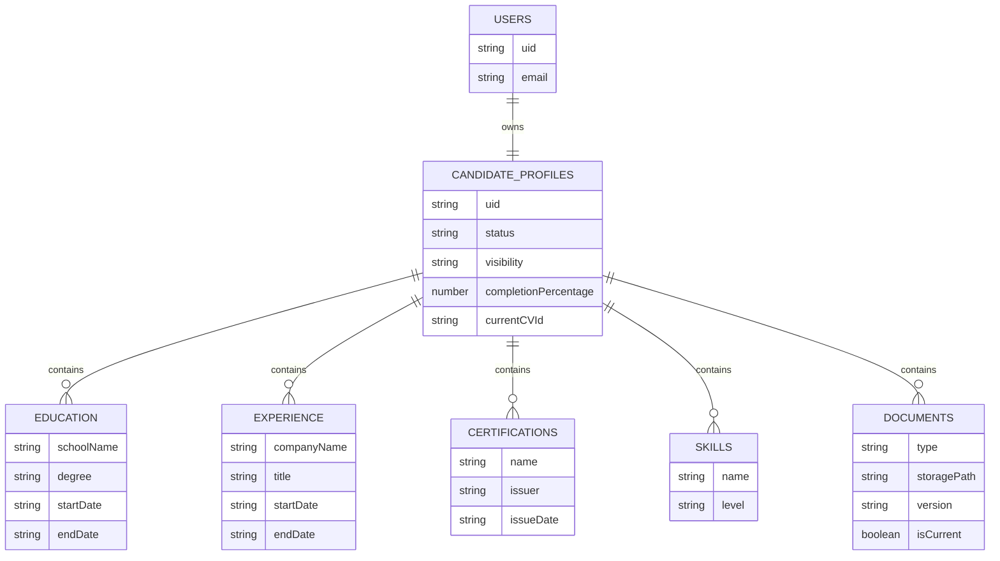

# Candidate Domain Architecture

## Scope

This document defines the architecture for the Candidate domain in TalentOne.

It covers the data model, lifecycle, profile completion, CV management, validations, and Firestore indexing strategy.

It does not implement UI, services, or business logic.

## Domain Goals

- Represent a candidate as a first-class domain entity.
- Keep the candidate profile separate from authentication identity.
- Support profile completion and staged publishing.
- Model CVs, education, experience, certifications, and skills cleanly.
- Keep the data queryable for future candidate search and profile management.

## Core Domain Boundary

- Firebase Authentication identifies the user.
- `candidateProfiles/{uid}` stores the canonical candidate profile.
- Nested subcollections store structured history and documents.
- Firestore remains the source of truth for profile state.
- Storage is used for uploaded files, while Firestore stores metadata and relationships.

## Candidate Profile Lifecycle

1. Account is created in Firebase Authentication.
2. `users/{uid}` is created as the canonical platform profile.
3. `candidateProfiles/{uid}` is created in `draft` state.
4. Candidate completes profile sections incrementally.
5. Candidate uploads CVs and supporting documents.
6. Profile reaches `in_review` or `published` depending on the platform rule.
7. Candidate can keep editing while maintaining version history.

## Profile States

- `draft`: newly created profile with incomplete data.
- `in_progress`: candidate is actively filling missing sections.
- `in_review`: profile is ready for validation or moderation.
- `published`: profile is visible according to visibility rules.
- `archived`: profile is inactive but retained.

## Completion Workflow

- Completion is calculated from required sections, not from a single flag.
- Required sections should be at least identity, headline, location, skills, experience, and CV.
- Each section can be tracked with a completion marker.
- The profile becomes publishable only when required sections are satisfied.
- Completion data should be derived from profile content, not manually trusted.

## CV Management

- CV files are stored in Firebase Storage.
- Firestore stores document metadata, file path, version, and active state.
- A candidate can keep multiple CV versions.
- One CV version can be marked as current.
- CV metadata should be linked back to the candidate profile.

## Firestore Structure

### `candidateProfiles/{uid}`

Canonical candidate profile.

Suggested fields:

- `uid`
- `status` (`draft`, `in_progress`, `in_review`, `published`, `archived`)
- `visibility` (`private`, `public`, `restricted`)
- `completionPercentage`
- `completionState`
- `headline`
- `location`
- `summary`
- `currentCVId`
- `primaryCVPath`
- `primaryCVUrl`
- `lastPublishedAt`
- `createdAt`
- `updatedAt`

### `candidateProfiles/{uid}/education/{educationId}`

Education history.

Suggested fields:

- `schoolName`
- `degree`
- `fieldOfStudy`
- `startDate`
- `endDate`
- `currentlyStudying`
- `description`
- `createdAt`
- `updatedAt`

### `candidateProfiles/{uid}/experience/{experienceId}`

Work experience history.

Suggested fields:

- `companyName`
- `title`
- `employmentType`
- `location`
- `startDate`
- `endDate`
- `currentlyWorking`
- `summary`
- `responsibilities`
- `createdAt`
- `updatedAt`

### `candidateProfiles/{uid}/certifications/{certificationId}`

Professional certifications.

Suggested fields:

- `name`
- `issuer`
- `issueDate`
- `expirationDate`
- `credentialId`
- `credentialUrl`
- `createdAt`
- `updatedAt`

### `candidateProfiles/{uid}/skills/{skillId}`

Candidate skills.

Suggested fields:

- `name`
- `level`
- `yearsOfExperience`
- `verified`
- `createdAt`
- `updatedAt`

### `candidateProfiles/{uid}/documents/{documentId}`

Candidate documents and CV versions.

Suggested fields:

- `type` (`cv`, `cover_letter`, `portfolio`, `other`)
- `title`
- `storagePath`
- `downloadUrl`
- `fileName`
- `mimeType`
- `fileSize`
- `version`
- `isCurrent`
- `createdAt`
- `updatedAt`

## Relationships

## Validations

- `uid` must match the Firebase Auth user.
- Candidate profile must not exist without a linked authenticated user.
- `status` and `visibility` must use the defined enums.
- Dates must be valid and ordered correctly.
- `endDate` must be equal to or later than `startDate` when present.
- Exactly one document should be flagged as the current CV.
- File metadata must match the actual uploaded file.
- Publishable profiles must satisfy required sections.

## Indexes

Recommended Firestore indexes if query patterns require them:

- `candidateProfiles`: `status` + `visibility` + `updatedAt desc`
- `candidateProfiles`: `completionPercentage` + `updatedAt desc`
- `candidateProfiles/{uid}/experience`: `currentlyWorking` + `startDate desc`
- `candidateProfiles/{uid}/education`: `currentlyStudying` + `startDate desc`
- `candidateProfiles/{uid}/documents`: `type` + `isCurrent desc` + `createdAt desc`

## Notes

- Skills can remain as documents or later be normalized into a taxonomy without changing the profile boundary.
- CV search and ranking should be added later as a separate domain concern.
- This structure keeps the candidate domain independent from authentication and company membership logic.
